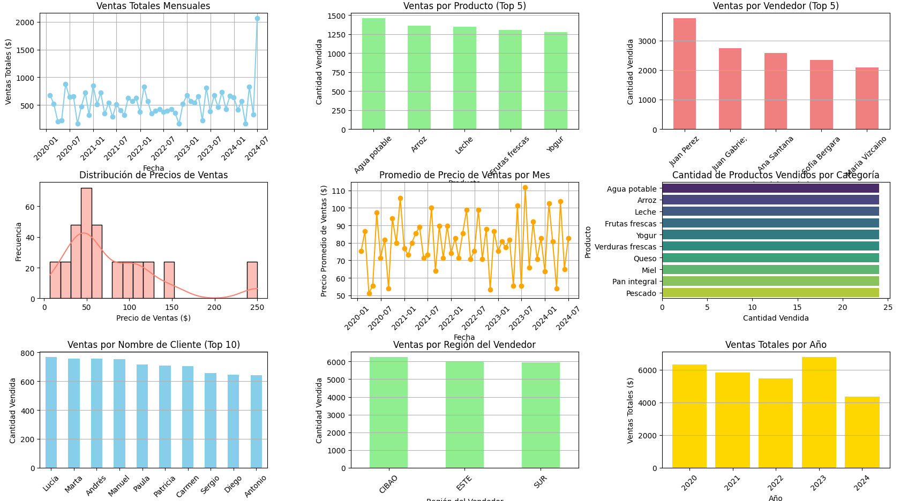

🛒 Base de Datos del Supermercado JPV 📊

### 📄 Introducción
La base de datos del Supermercado JPV contiene un registro detallado de las transacciones de ventas realizadas por el supermercado. Esta información incluye datos sobre los clientes, vendedores, productos y las ventas individuales. La base de datos se puede utilizar para realizar un análisis exhaustivo del desempeño de las ventas, el comportamiento de los clientes y la eficiencia de los vendedores.

## Portada:
---

### 📋 Estructura de los Datos
La base de datos está organizada en varias columnas que describen diferentes aspectos de cada transacción de venta. A continuación se detallan los campos principales:

- **ID_Pedido**: Identificador único de cada pedido.
- **Fecha**: Fecha en la que se realizó el pedido.
- **ID_Cliente**: Identificador único del cliente que realizó el pedido.
- **Nombre_Cliente**: Nombre del cliente.
- **Apellido_Cliente**: Apellido del cliente.
- **ID_Vendedor**: Identificador único del vendedor que gestionó el pedido.
- **Nombre_Vendedor**: Nombre del vendedor.
- **Genero_Vendedor**: Género del vendedor.
- **Sucursal_Vendedor**: Identificador de la sucursal a la que pertenece el vendedor.
- **Provincia_Vendedor**: Provincia donde se encuentra la sucursal del vendedor.
- **Latitud**: Coordenada de latitud de la ubicación del vendedor.
- **Longitud**: Coordenada de longitud de la ubicación del vendedor.
- **Region_Vendedor**: Región a la que pertenece la sucursal del vendedor.
- **ID_Producto**: Identificador único del producto vendido.
- **Nombre_Producto**: Nombre del producto vendido.
- **Precio_Compra**: Precio de compra del producto.
- **Precio_Ventas**: Precio de venta del producto.
- **Cantidad**: Cantidad de productos vendidos en el pedido.
- **Ingreso_Total**: Ingreso total generado por la venta del pedido.
- **Foto_Producto**: URL de la imagen del producto.
- **Foto_Vendedor**: URL de la imagen del vendedor.

### 🌐 Temática y Análisis Potencial
La base de datos ofrece una amplia gama de posibilidades para realizar análisis de diversa índole, entre los que se incluyen:

1. **Análisis de Ventas**: Evaluar el rendimiento de las ventas a lo largo del tiempo, identificando patrones estacionales y tendencias de ventas.
2. **Análisis de Clientes**: Segmentar a los clientes en función de sus patrones de compra, permitiendo la creación de estrategias de marketing personalizadas.
3. **Análisis de Desempeño de Vendedores**: Medir la efectividad y el rendimiento de los vendedores, identificando a los mejores y a los que necesitan mejorar.
4. **Análisis Geoespacial**: Visualizar la distribución geográfica de las ventas y la localización de los vendedores para identificar áreas de alto y bajo rendimiento.
5. **Análisis de Productos**: Determinar los productos más y menos vendidos, así como el margen de beneficio asociado a cada uno, lo que ayuda en la gestión del inventario y en la planificación de compras.

### 📝 Conclusión
La base de datos del Supermercado JPV es una herramienta valiosa para realizar análisis profundos y detallados sobre diversos aspectos de las operaciones de ventas. Proporciona información crucial para la toma de decisiones estratégicas y la mejora continua de las prácticas comerciales.
